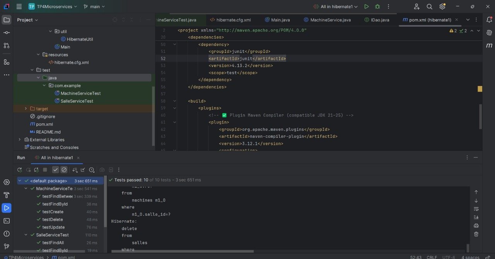
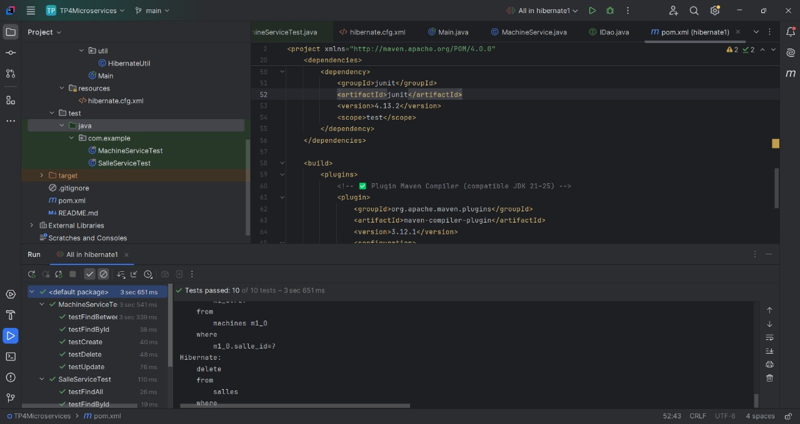

# TP4_Microservices

## Hibernate & JUnit Tests Execution

The following screenshots illustrate the project structure and the successful execution of unit tests using Hibernate and JUnit within IntelliJ IDEA.

This figure shows the project organization, including Hibernate configuration, DAO layers, and test classes.

This figure demonstrates the successful execution of unit tests, confirming that all CRUD operations were validated correctly.
